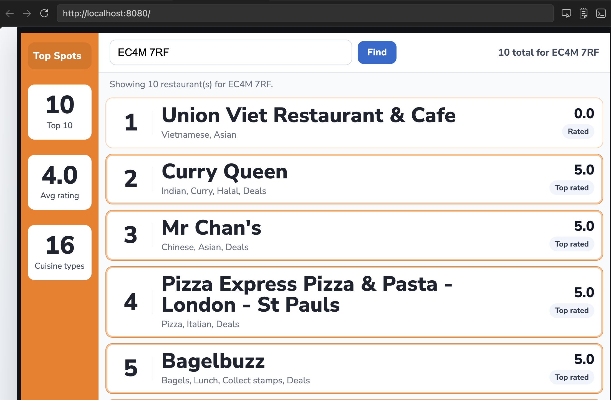

## hunger-games

### Overview

A SpringBoot API that retrieves restaurants for a given postcode using an external API.

### Features

- Search restaurants by postcode
- Display name, cuisines and rating
- Integrates with external API
- Transforms raw data into a simplified format
- Basic error handling for invalid or empty response

### Assumptions

- External API is available and returns valid data
- No pagination is implemented(returns available results only)

### Limitations

- No caching of API responses
- Limited error handling for edge cases1§

### UI Preview



### Example API Response

```json
[
  {
    "name": "Curry Queen",
    "cuisines": ["Indian", "Curry", "Halal", "Deals"],
    "rating": 5
  },

  {
    "name": "Mr Chan's",
    "cuisines": ["Chinese", "Asian", "Deals"],
    "rating": 5
  }
]
```

### Endpoint

```
GET /restaurants/{postcode}

Example:
http://localhost:8080/restaurants/EC4M7RF
```

### Example API Response

### Tech Stack

- Java
- SpringBoot
- JUnit

### How to Run

```
cd hunger-games
./mvnw spring-boot:run

then open:
http://localhost:8080
```

### Testing

Run tests with:

```
./mvnw test
```

### Architecture

- Controller handles income requests
- Service layer processes business logic
- Client calls the external API
- DTO ensures only required fields are returned

### Infrastructure Decisions

- Used a service layer to handle business logic
- Introduced a Data Transfer Object (DTO) to control exposed fields
- Integrated external API via a client class
- Added basic error handling to ensure stability

### AI Usage

- Used AI as a support tool for styling, refining tests, improving error handling and general code review. All generated suggestions were reviewed and understood before being applied

### Future Improvements

- Add caching to reduce repeated external API calls
- Implement pagination for large result sets
- Improve error handling and user feedback
- Add input validation for postcode format
- Introduce integration test for end to end coverage
